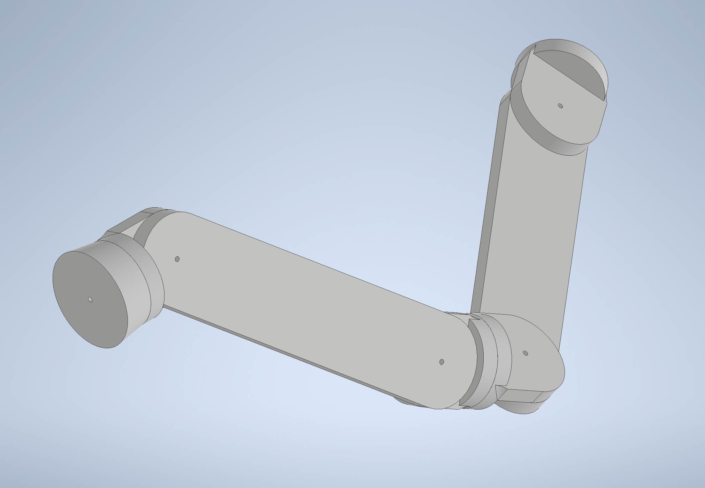

# Robotic Arm Description Exercise

## Instruction

Given a set of mesh files for a robotic arm. Create a URDF model for the robotic arm. The URDF model should have working joints (use RViz to test this).

The robotic arm assembly has three parts:
- Shoulder Base: The base of the robotic arm which is fixed to the world.
- Arm Link: The part giving the robotic arm reach.
- Joint Hub: The part that allows joint rotation across 2 planes.

Each part has 3 mm holes to mark where a joint can be placed.

The robotic arm assembly looks like this:

